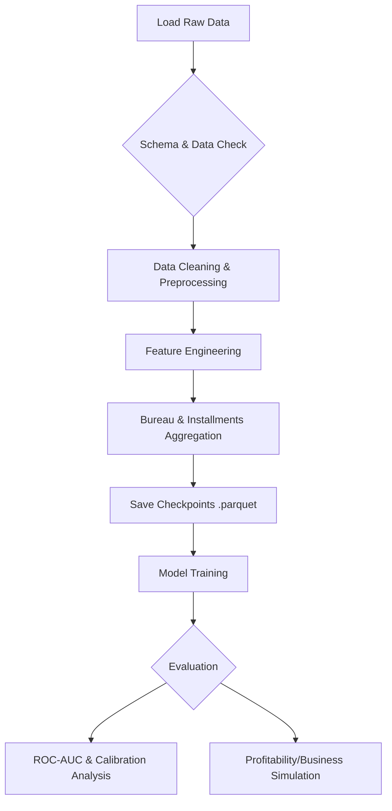

# Credit Default Risk Prediction — Home Credit Indonesia


## 1. Project Title & Brief Description

**Credit Default Risk Prediction**

This project aims to develop a robust, end-to-end **Machine Learning** model to predict credit default risk for Home Credit Indonesia. The core problem addressed is the dilemma between **minimizing Non-Performing Loans (NPL)** and **maximizing revenue potential**. This solution goes beyond binary predictions (Default/Non-Default) by providing calibrated risk probabilities, enabling the business to set dynamic approval thresholds based on financial strategy and profitability targets.

## 2. Key Features

- **Business-Centric EDA**: Goes beyond standard charting by analyzing the financial impact of each feature.
- **Advanced Feature Engineering**: Complex aggregation strategies for relational data (e.g., credit bureau records, installment history, cash balances) to capture comprehensive customer behavior.
- **Memory-Efficient Checkpointing**: A mechanism to save intermediate steps in Parquet format, allowing processing of large datasets (~8GB RAM requirement) without losing progress upon kernel restarts.
- **Profitability Simulation**: A custom module that translates technical metrics (like ROC-AUC) into estimated financial value (IDR), bridging the gap between Data Science and business decision-making.
- **Imbalanced Data Handling**: Optimization using appropriate evaluation metrics (ROC-AUC, Precision-Recall) to handle the target class imbalance (~8% default rate).

## 3. Tech Stack

Here are the main technologies and libraries used in this project:

- **Programming Language**: Python 3.x
- **Data Manipulation**: Pandas (v2.3.3), NumPy (v2.2.6)
- **Data Storage**: PyArrow (v22.0.0) - for fast Parquet file operations.
- **Visualization**: Matplotlib (v3.10.8), Seaborn (v0.13.2)
- **Machine Learning**: Scikit-Learn (v1.8.0)
  - _Models_: Logistic Regression, Random Forest, HistGradientBoostingClassifier.
  - _Preprocessing_: ColumnTransformer, OneHotEncoder, StandardScaler, OrdinalEncoder.

## 4. Project Structure

```
📦 FINAL PROJECT HCI
 ┣ 📂 data/                         # Raw data storage folder (CSV)
 ┃ ┣ 📜 application_train.csv       # Main training dataset
 ┃ ┣ 📜 bureau.csv                  # Credit history data from other bureaus
 ┃ ┗ 📜 ... (other CSV files)
 ┣ 📂 outputs/                      # Outputs generated by the notebook
 ┃ ┣ 📂 figures/                    # Saved plots and visualizations
 ┃ ┣ 📜 train_master.parquet        # Checkpoint: Processed training data
 ┃ ┣ 📜 test_master.parquet         # Checkpoint: Processed testing data
 ┃ ┗ 📜 submission.csv              # Final prediction submission
 ┣ 📜 HCI_Credit_Default_Risk_prediction.ipynb  # Main Notebook (Full Workflow)
 ┣ 📜 requirements.txt              # Python package dependencies
 ┗ 📜 README.md                     # Project documentation
```

### Workflow



## 5. Prerequisites & Installation

### Prerequisites

Before running this project, ensure you have installed:

- **Python 3.8+**
- **Jupyter Notebook** or an IDE supporting `.ipynb` (like VS Code, JupyterLab).

### Installation Steps

1.  **Clone the Repository** (if using git):

    ```bash
    git clone https://github.com/username/project-repo.git
    cd project-repo
    ```

2.  **Install Dependencies**:
    It is recommended to use a _virtual environment_.

    ```bash
    pip install -r requirements.txt
    ```

3.  **Data Preparation**:
    - Download the Home Credit Default Risk dataset.
    - Ensure all CSV files (e.g., `application_train.csv`, `bureau.csv`, etc.) are placed inside the `data/` folder.

## 6. Usage

The project is executed via a single main Jupyter Notebook that covers the entire workflow.

1.  Open your terminal or command prompt.
2.  Launch Jupyter Notebook:
    ```bash
    jupyter notebook
    ```
3.  Open the file `HCI_Credit_Default_Risk_prediction.ipynb`.
4.  **Cache Configuration**:
    In the initial cells of the notebook, you can set the `USE_CACHE` variable:
    - `USE_CACHE = True` (Default): Uses _checkpoint_ files (parquet) if available, speeding up execution time by skipping heavy _feature engineering_ steps.
    - `USE_CACHE = False`: Forces the notebook to re-process all data from scratch (Raw CSV).
5.  Execute all cells sequentially (_Run All_).
6.  Analysis results, plots, and predictions will be automatically saved in the `outputs/` folder.

## 7. Contribution

Contributions are welcome! If you'd like to improve this project:

1.  Fork this repository.
2.  Create a new feature branch (`git checkout -b feature-new`).
3.  Commit your changes (`git commit -m 'Add XYZ feature'`).
4.  Push to the branch (`git push origin feature-new`).
5.  Create a Pull Request.

## 8. License

This project is distributed under the **MIT License**.

---

_Created for Final Project HCI - Home Credit Indonesia Credit Risk Scoring._
